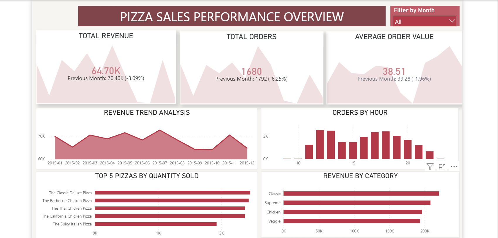
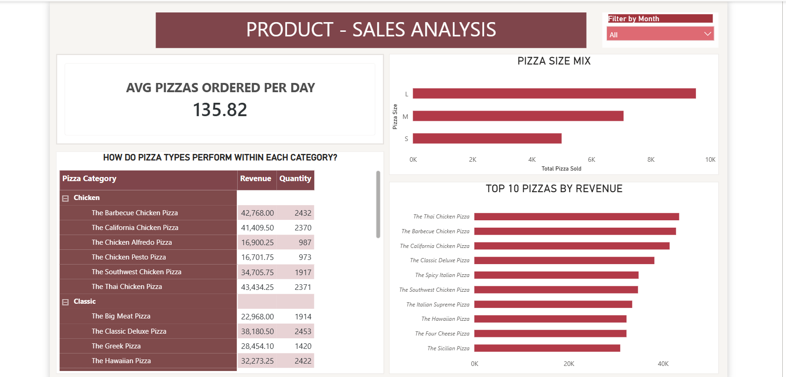
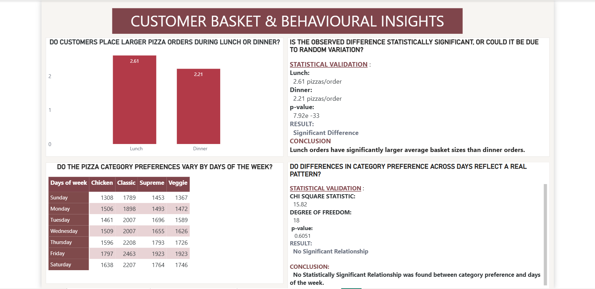

# 🍕 Pizza Sales Analysis: SQL, Statistical Testing & Power BI Dashboard

An end-to-end data analysis project on 21,350 pizza orders. It combines SQL for business KPIs, Python for hypothesis testing, and a three-page Power BI report for stakeholder-facing insights.

---

## 📌 Project Overview

This project analyzes restaurant order data to answer three questions:

1. **Performance:** How much revenue is generated, which pizzas and categories lead, and how sales change over time?
2. **Product:** Which pizza types, sizes, and categories drive sales and revenue?
3. **Customer Behaviour:** Do ordering patterns differ by meal time and by day of the week, and are those differences statistically significant?

The work moves from raw data to a database, then to SQL analysis, statistical testing, and a final dashboard.

---

## 🏗️ Project Structure

```
pizza-sales-sql-analysis/
│
├── datasets/                      # Raw CSV data
│   ├── orders.csv                 # 21,350 orders (order_id, date, time)
│   ├── order_details.csv          # 48,620 line items (order_id, pizza_id, quantity)
│   ├── pizzas.csv                 # 96 pizza variants (pizza_id, size, price)
│   └── pizza_types.csv            # 32 pizza types (name, category, ingredients)
│
├── build_db.py                    # Creates pizza_sales.db and loads the CSVs
├── pizza_sales.db                 # SQLite database (generated)
├── pizza_sales_analysis.sql       # 13 business-question SQL queries
├── t_test.py                      # Two-sample t-test: lunch vs. dinner basket size
├── chi_square_test.py             # Chi-square test: pizza category vs. day of week
├── pizza_sales report.pbix        # 3-page Power BI dashboard
├── .gitignore
├── README.md
└── screenshots/                   # Power BI dashboard images
    ├── performance_overview.png
    ├── product_sales_analysis.png
    └── consumer_behaviour_analysis.png
```

---

## 🛠️ Tech Stack

| Layer | Tools |
|---|---|
| Database | SQLite |
| Querying | SQL (joins, CTEs, subqueries, window functions: `RANK`, `ROW_NUMBER`, `LAG`, cumulative `SUM`) |
| Data processing | Python, pandas |
| Statistics | SciPy (`ttest_ind`, `chi2_contingency`) |
| Visualization | Power BI |

---

## ⚙️ Pipeline

### 1. Build the database: `build_db.py`
Creates four related tables (`orders`, `pizza_types`, `pizzas`, `order_details`) with primary and foreign keys, then loads the CSV files into them.

### 2. Analyze with SQL: `pizza_sales_analysis.sql`
Answers 13 business questions, grouped by difficulty:

**Basic**
- Total orders placed
- Total revenue generated
- Highest-priced pizza
- Most commonly ordered size
- Top 5 pizza types by quantity

**Intermediate**
- Category-wise distribution of pizzas
- Hourly order distribution
- Average pizzas ordered per day
- Top 3 pizza types by revenue
- Total quantity per category

**Advanced**
- Percentage revenue contribution by category (CTE and subquery approaches)
- Cumulative revenue over time (window functions)
- Top 3 pizzas by revenue within each category (`ROW_NUMBER` with `PARTITION BY`)

The file also covers peak-hour basket size, market basket pairings, multi-item order ratios, month-over-month growth, and day-of-week category dominance.

### 3. Statistical testing

**Two-sample t-test (`t_test.py`)**
- **Question:** Is the average number of pizzas per order different between lunch (12 PM to 2 PM) and dinner (5 PM to 8 PM)?
- **H₀:** Mean order quantities for lunch and dinner are equal.
- **Hₐ:** Mean order quantities differ significantly.
- **Significance level:** α = 0.05

**Chi-square test of independence (`chi_square_test.py`)**
- **Question:** Do pizza category preferences depend on the day of the week?
- **H₀:** Category preferences are independent of the day of the week.
- **Hₐ:** Category preferences depend on the day of the week.
- **Significance level:** α = 0.05

### 4. Power BI dashboard: `pizza_sales report.pbix`

A three-page interactive report:

1. **Performance Overview:** headline KPIs, revenue and order trends, and overall sales performance
2. **Product Sales Analysis:** sales by pizza type, size, and category
3. **Customer Behaviour Analysis:** ordering patterns and statistical testing results





---

## 📊 Key Findings

**Business performance**
- **Total orders:** 21,350
- **Total revenue:** $817,860
- **Top revenue pizza:** Thai Chicken Pizza, generating $43,434.25
- **Leading category:** Classic, contributing 26.91% of total revenue

**Statistical testing**
- **Lunch vs. dinner basket size (t-test):** The difference is statistically significant (t = 11.96, p ≈ 7.9 × 10⁻³³ < 0.05). Lunch and dinner orders differ in average pizza quantity, so we reject the null hypothesis.
- **Day of week vs. category preference (chi-square test):** No significant relationship was found (χ² = 15.82, df = 18, p = 0.605 > 0.05). The data does not provide evidence that category preferences depend on the day of the week, so we fail to reject the null hypothesis.

---

## 🚀 How to Run

**Prerequisites:** Python 3.8+, and the following packages:

```bash
pip install pandas scipy
```

**Steps:**

```bash
# 1. Clone the repository
git clone https://github.com/sommyaloharuka2002/pizza-sales-analysis.git
cd pizza-sales-analysis

# 2. Build the database
python build_db.py

# 3. Run the statistical tests
python t_test.py
python chi_square_test.py
```

**SQL queries:** Open `pizza_sales.db` in any SQLite client (for example, DB Browser for SQLite) and run the queries in `pizza_sales_analysis.sql`.

**Dashboard:** Open `pizza_sales report.pbix` in Power BI Desktop.

---

## 💡 Skills Demonstrated

- Relational database design with primary and foreign keys
- Advanced SQL: CTEs, subqueries, window functions, and date/time handling
- Business KPI analysis and interpretation
- Hypothesis testing and statistical inference in Python
- Dashboard design and storytelling in Power BI

---

## 👩‍💻 Author

**Sommya Loharuka**
🔗 [GitHub](https://github.com/sommyaloharuka2002)

---

## 🙏 Acknowledgements

The dataset "Pizza Place Sales" is available on Maven Analytics. The SQL queries were written and run independently, and were inspired by a YouTube tutorial. The database design, statistical analysis, and Power BI dashboard were developed independently.